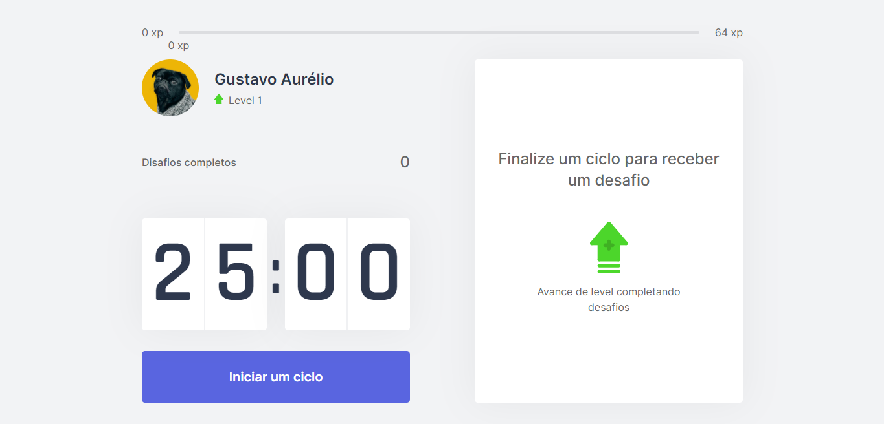

# Next-Moveit

### ℹ Descrição

O projeto tem foco na técnica [Pomodoro](https://pt.wikipedia.org/wiki/T%C3%A9cnica_pomodoro), apresentando desafios a cada 25 minutos, apos iniciar o temporizador. 
A cada tarefa completada, você ganha uma quantidade de experiencia.

### 🤼‍♀️ Funcionalidades

- <small> Desafios a cada tarefa completada </small>
- <small> Sistema de níveis </small>

### 🧪 Tecnologias

- [React](https://reactjs.org/)
- [Next Js](https://nextjs.org/)
- [Js Cookie](https://github.com/js-cookie/js-cookie)
